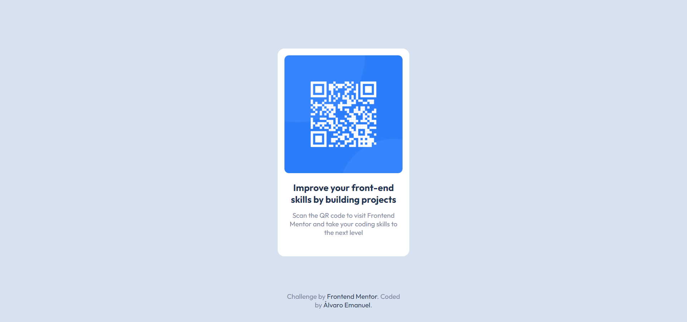

# Frontend Mentor - QR code component solution

This is a solution to the [QR code component challenge on Frontend Mentor](https://www.frontendmentor.io/challenges/qr-code-component-iux_sIO_H). Frontend Mentor challenges help you improve your coding skills by building realistic projects. 

## Table of contents

- [Overview](#overview)
  - [Screenshot](#screenshot)
  - [Links](#links)
- [My process](#my-process)
  - [Built with](#built-with)
  - [What I learned](#what-i-learned)
  - [Continued development](#continued-development)
  - [Useful resources](#useful-resources)
- [Author](#author)
- [Acknowledgments](#acknowledgments)

## Overview

### Screenshot

### Links

- Solution URL: [Add solution URL here](https://github.com/AlvaroEmanuel20/qr-code-component)
- Live Site URL: [Add live site URL here](https://alvaroemanuel20.github.io/qr-code-component/)

## My process

### Built with

- Semantic HTML5 markup
- CSS custom properties
- CSS variables
- Flexbox
- Mobile-first workflow

### What I learned

This exercise helped me to exercise HTML and CSS, in addition to Flexbox which is a great help in building the page. I really liked the project.

## Author

- Website - [Álvaro Emanuel](https://www.alvaroemanuel.com/portfolio)
- Frontend Mentor - [@AlvaroEmanuel20](https://www.frontendmentor.io/profile/AlvaroEmanuel20)
- Instagram - [@alvaro1dias](https://www.instagram.com/alvaro1dias/)
