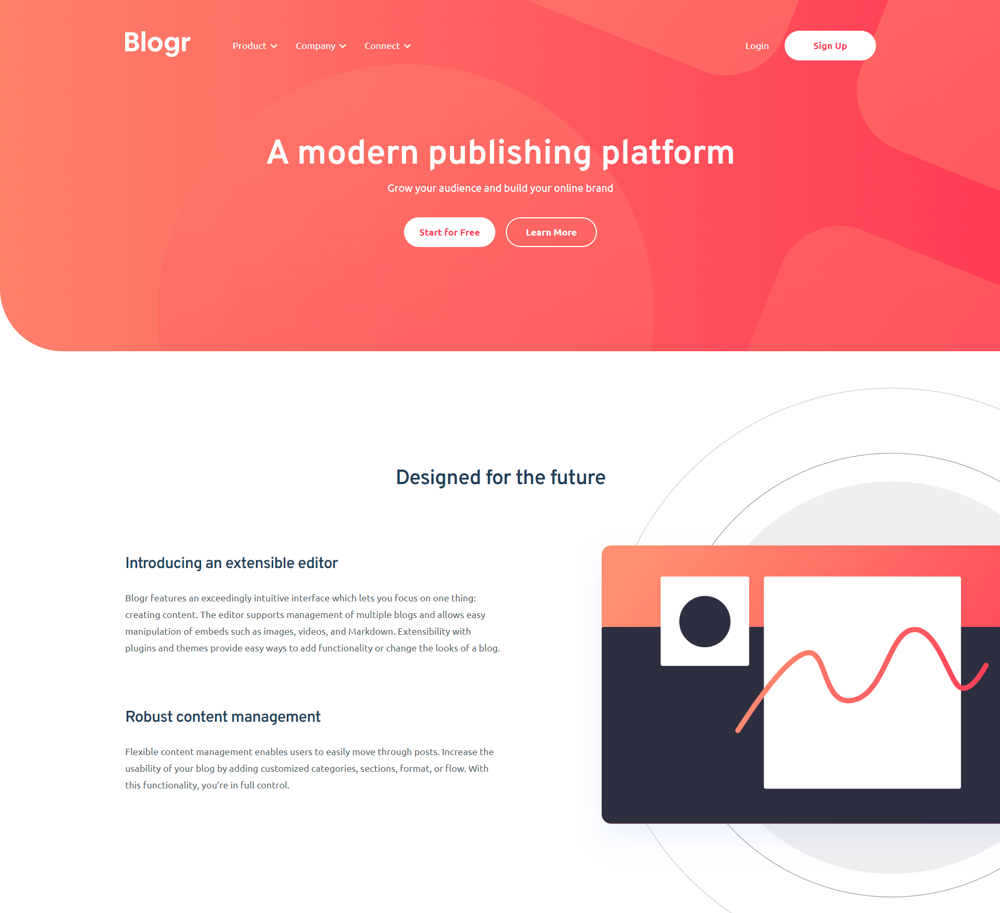

# Blogr Landing Page - Frontend Mentor

Essa é a solução para o desafio do Frontend Mentor [Blogr Landing Page](https://www.frontendmentor.io/challenges/blogr-landing-page-EX2RLAApP). Um desafio criado para aprimorar as habilidades em CSS, HTML e Javascript.

## Screenshots

## Links

Live site: [https://alvaroemanuel20.github.io/blogr-landing-page/](https://alvaroemanuel20.github.io/blogr-landing-page/)

Link da solução: [https://github.com/AlvaroEmanuel20/blogr-landing-page](https://github.com/AlvaroEmanuel20/blogr-landing-page)
## Construído com

Design: HTML, CSS e Sass

Interatividade: Javascript

## Funcionalidades

- Dropdown menu
- Menu responsivo
- Responsivo

## Aprendizado

Com esse projeto foi possível aprimorar habilidades em Javascript. Para a criação do menu dropdown utilizei conceitos do DOM e de objetos, além da estrutura `switch`.

No CSS foi possível exercitar a responsividades e animações. Além de que revisei `mixins` e nested estrutura em Sass.

## Autor

- [Álvaro Emanuel](https://www.github.com/AlvaroEmanuel20)

## 🔗 Links

Meu site: [alvaroemanuel.com](https://alvaroemanuel.com)
